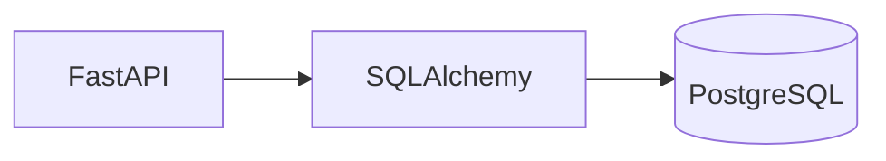

### 1. Documentation Model
- Use `README.md` for orientation, prerequisites, quickstart, and links to deeper documentation
- Use manual docs for architecture, explanations, onboarding, operations, migrations, and task-focused guides
- Use `mkdocstrings` for API reference generated directly from public Python code
- Do not use autogenerated API output as a substitute for human-written guides
- Keep docs organized with a Diataxis-style split: tutorials, how-to guides, reference, and explanation

### 2. README Requirements
- The repository `README.md` must answer what the repository is, why it exists, how to start it quickly, and where the full docs live
- Keep the README short and practical; do not turn it into the full architecture guide or API reference
- Include repository purpose, high-level architecture, prerequisites, quickstart commands, and links to the docs site
- Include a brief overview of the major services, libraries, or packages when that improves navigation

### 3. Manual Documentation Standards
- Put manual docs in `docs/` and organize them by topic rather than by team history or meeting notes
- Use manual docs for architecture, ADRs, onboarding, deployment, operations, auth flows, ownership boundaries, and migration procedures
- Prefer clear workflow and decision documentation over narrative prose
- Document behavior, assumptions, invariants, and operating constraints rather than low-value implementation trivia
- Keep operational knowledge in docs even when related code already exists; code alone is not enough for runbooks or architecture rationale

### 4. API Reference Standards
- Use `mkdocstrings[python]` for public modules, public classes, public functions, shared library APIs, schemas, settings models, and service interfaces
- Limit generated reference pages to stable public surfaces that internal or external consumers are expected to use
- Do not publish undocumented public APIs by default; missing docstrings should be treated as a quality issue
- Keep API reference pages separate from architecture and guide pages
- Use small hand-written introductions above `:::` directives so readers understand the purpose of the referenced module

### 5. MkDocs and mkdocstrings Configuration
- Use MkDocs as the site generator and Material for MkDocs as the default theme
- Install documentation tooling with `uv add --dev mkdocs-material mkdocstrings[python]`
- Configure `mkdocstrings` with Python source paths that point at each package `src/` root in the monorepo
- Set `docstring_style: google` to match team conventions
- Set `show_if_no_docstring: false` to prevent undocumented APIs from silently appearing in reference pages
- Keep site navigation explicit in `mkdocs.yml` so guides and references remain easy to find

Recommended baseline `mkdocs.yml`:

```yaml
site_name: My Monorepo Docs

theme:
  name: material
  features:
    - navigation.tabs
    - navigation.indexes
    - toc.integrate

plugins:
  - search
  - mkdocstrings:
      default_handler: python
      handlers:
        python:
          paths:
            - libs/shared_db/src
            - services/user_api/src
          options:
            docstring_style: google
            show_source: true
            show_root_heading: true
            show_if_no_docstring: false
            heading_level: 2

markdown_extensions:
  - admonition
  - pymdownx.details
  - pymdownx.superfences
  - pymdownx.tabbed:
      alternate_style: true

nav:
  - Home: index.md
  - Architecture: architecture.md
  - Guides:
    - Database Migrations: guides/db-migrations.md
  - API Reference:
    - Shared DB: reference/shared_db.md
    - User API: reference/user_api.md
```

### 6. Documentation Site Structure
- Use a top-level structure such as `docs/index.md`, `docs/architecture.md`, `docs/guides/`, and `docs/reference/`
- Keep conceptual pages, how-to guides, and API reference in separate locations
- In monorepos, ensure each documented package or service has a clear home in navigation
- Reference pages should remain thin and mostly delegate to `mkdocstrings`

Recommended monorepo layout:

```text
my-monorepo/
├── pyproject.toml
├── README.md
├── mkdocs.yml
├── docs/
│   ├── index.md
│   ├── architecture.md
│   ├── guides/
│   └── reference/
├── libs/
│   └── shared_db/
│       ├── pyproject.toml
│       └── src/shared_db/
└── services/
    └── user_api/
        ├── pyproject.toml
        └── src/user_api/
```

Example reference page:

```md
# Shared Database Reference

This package contains shared SQLAlchemy models and validation schemas.

## Models

::: shared_db.models
```

### 7. Manual Markdown Authoring
- Standard Markdown is sufficient for most documentation; do not invent custom formatting rules without a clear need
- Use headings, links, lists, code fences, tables, and blockquotes directly
- Use Material extensions only when they improve comprehension rather than decoration
- Use admonitions for warnings, caveats, and operational notes
- Use collapsible sections for optional detail, large outputs, or troubleshooting logs
- Use tabs only when showing alternative commands or environment-specific workflows
- Use Mermaid diagrams for architecture, data flow, and process documentation when a diagram is clearer than prose

Examples:

```md
!!! warning "Migration Order Matters"
    Apply schema migrations before deploying the new service version.
```

```md
??? info "Troubleshooting Output"
    Full command output goes here.
```

````md
=== "uv"
    ```bash
    uv sync
    ```

=== "pip"
    ```bash
    pip install -r requirements.txt
    ```
````

````md

````

### 8. Docstring Standards for Python
- Use Google-style docstrings for public Python APIs
- Rely on type hints for types; do not duplicate type information unnecessarily in docstrings
- Focus docstrings on behavior, side effects, invariants, failure modes, and return semantics
- Prioritize docstrings for exported functions, public classes, service interfaces, shared utilities, and externally visible schemas
- Internal helpers only need full docstrings when they are complex, reused, or easy to misuse

Preferred pattern:

```python
def create_user(user_in: UserCreate) -> UserResponse:
    """Creates a new user record.

    Hashes the password and commits the transaction.

    Args:
        user_in: The validated user creation payload.

    Returns:
        The created user including its assigned identifier.

    Raises:
        HTTPException: If the email already exists.
    """
```

### 9. Pydantic, FastAPI, SQLAlchemy, and Shared Library Guidance
- Treat Pydantic models and settings as part of the public contract when they cross service or library boundaries
- Document the purpose of settings and schema models, and document fields when their meaning is not obvious
- For FastAPI services, manual docs should explain service purpose, request flow, auth model, deployment assumptions, and runbooks
- For SQLAlchemy packages, manual docs should explain schema ownership, migration process, transaction boundaries, and data lifecycle assumptions
- For shared libraries, keep API references current and document them as reusable internal products rather than incidental code

Example settings model:

```python
class AppSettings(BaseSettings):
    """Application configuration loaded from environment variables.

    Attributes:
        database_url: PostgreSQL connection string.
        api_key: Internal service authentication secret.
    """

    database_url: PostgresDsn
    api_key: SecretStr
```

### 10. Publishing and Hosting
- Preview documentation locally with `uv run mkdocs serve`
- Publish built HTML rather than raw Markdown when hosting documentation for teams
- Use GitLab Pages for internal GitLab-hosted repositories when available
- Use GitHub Pages when that matches the repository host and permissions model
- Restrict visibility appropriately when the docs contain internal architecture or operational details

Example GitLab Pages job:

```yaml
pages:
  stage: deploy
  image: python:3.12-slim
  script:
    - pip install uv
    - uv sync --all-extras
    - uv run mkdocs build --site-dir public
  artifacts:
    paths:
      - public
  rules:
    - if: '$CI_COMMIT_BRANCH == "main"'
```

Example GitHub Pages workflow:

```yaml
name: Publish Docs

on:
  push:
    branches: [main]

permissions:
  contents: write

jobs:
  deploy:
    runs-on: ubuntu-latest
    steps:
      - uses: actions/checkout@v4
      - uses: astral-sh/setup-uv@v2
      - run: uv python install
      - run: uv sync --all-extras
      - run: uv run mkdocs gh-deploy --force
```

### 11. Documentation Quality Bar
- Treat documentation as part of the product and review it like code
- Keep responsibilities separate: README for orientation, manual docs for knowledge and workflows, autogenerated docs for API reference
- Write for the actual consumers of the repository: maintainers, integrators, operators, and reviewers
- If a module is intended to appear in the docs, its public surface must have meaningful names, stable exports, type hints, and docstrings
- Keep architecture and operational guidance close to the codebase, but do not trap it inside code comments or docstrings alone

### 12. Minimum Repository Standard
- Each repository should have a `README.md` with purpose, quickstart, and a link to the docs site
- Each repository should have an MkDocs site with Material theme
- Each repository should have manual docs for architecture and key workflows
- Each repository should have `mkdocstrings` reference pages for public packages and services
- Public APIs should use Google-style docstrings with full type hints
- CI should build and publish the documentation site
